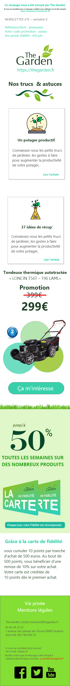
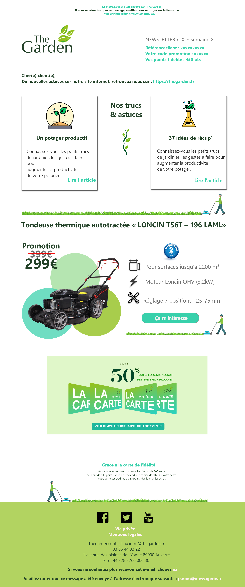

Readme 

#Proposition Newsletter pour The Garden n°2

#Couleurs :
- bleu: #38d0ab
- grey: #707070,
- dark-green: #224127,
- medium-green: #219e13,
- lighter-green: #e0f7c9,
- greenfooter: #84DE33,
- white: #ffffff,

# Choix des couleurs : 
Nous avons conservé les couleurs de la carte de fidélité afin de rester homogène avec le projet.

#Police de caractère : 
 - Segoe UI

# Disposition : 
- Les sections qui ne varient pas en fonction de la newsletter : 

  ~ Header avec la mention « ce message vous a été envoyé par » et la mention de redirection sur le site
    Les références clients sont optionnelles.
    Si possible, la phrase « cher( e ) client (e ), sera adapté à la base de donnée du publipostage en fonction du genre.

  ~ Section 3 la carte de fidélité, sera toujours présente sur les newsletters pour inciter le client à s’inscrire dans la base de données client, avec le bouton qui       
    permettra une redirection vers le formulaire de création de carte de fidélité du site.

  ~ Footer avec des liens sur les réseaux sociaux, les coordonnées et les mentions de désabonnement.

- Les sections qui varient en fonction de la newsletter : 

  ~ Section 1, nous avons créer un exemple avec 2 cards, mais nous pouvons multiplier les cards en fonction des nouveaux articles publiés sur le site. 

  ~ Section 2, permet la promotion de la tondeuse, un bouton « clic to action » nous renvoi directement sur la fiche du produit du site.

# Notes :
Aucune animation ou transition, mais nous pouvons en prévoir si nécessaire.

# Preview

